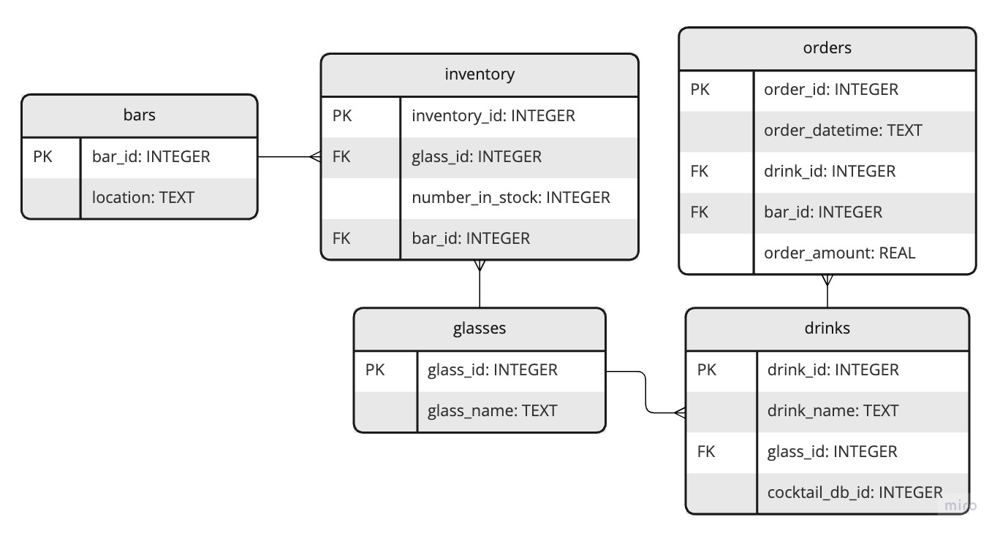

# Documentation

## ERD diagram

## Outputs

### data_tables.sql

A SQL file with the CREATE TABLE statements for setting up the bar_database.db SQLite database

### build_database.py

- A _single_ python script which:
  - Reads in the datafiles
  - Imports the relevant data from the cocktails database API
  - Generates the data for the database
  - Creates the database and tables using the data_tables SQL script
  - Imports the data to the database

### bar_database.db

- A .sqlite database

### bar-database

- A repository which is in good condition for analysts to take over your work.

### poc_tables.sql

- A SQL file with the queries to create a PoC table for the bar staff to manage glass stock.
- The table should show the glasses ordered in each bar on each day, which will help with managing stock levels as you can identify a pattern of orders and then choose daily inventory accordingly.
